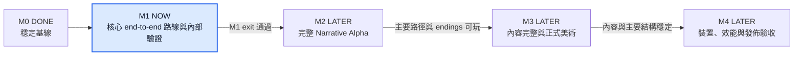
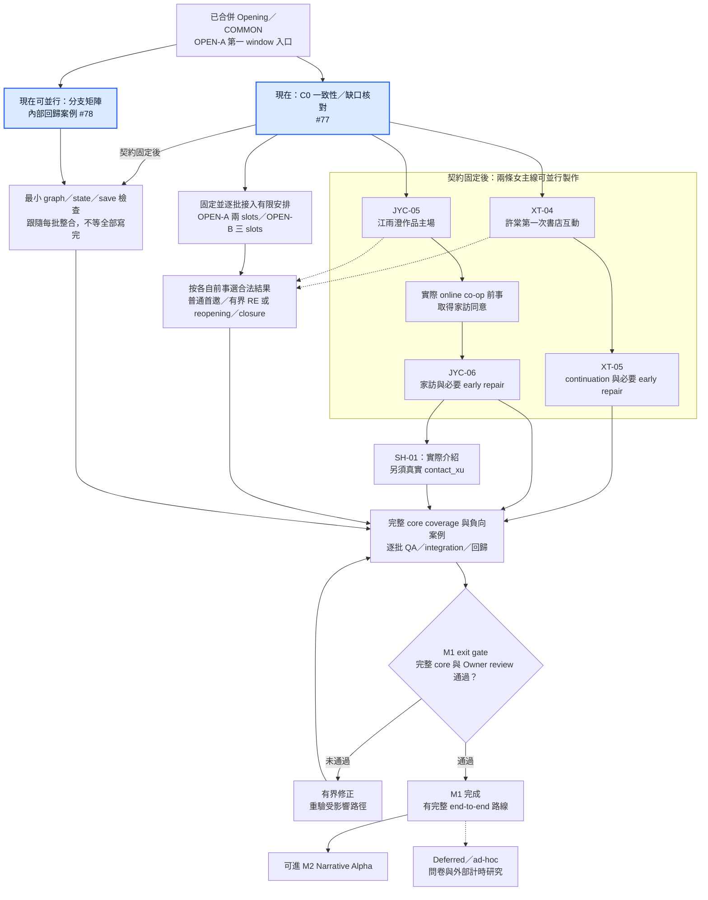
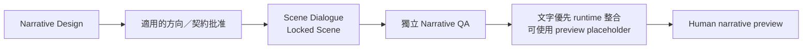
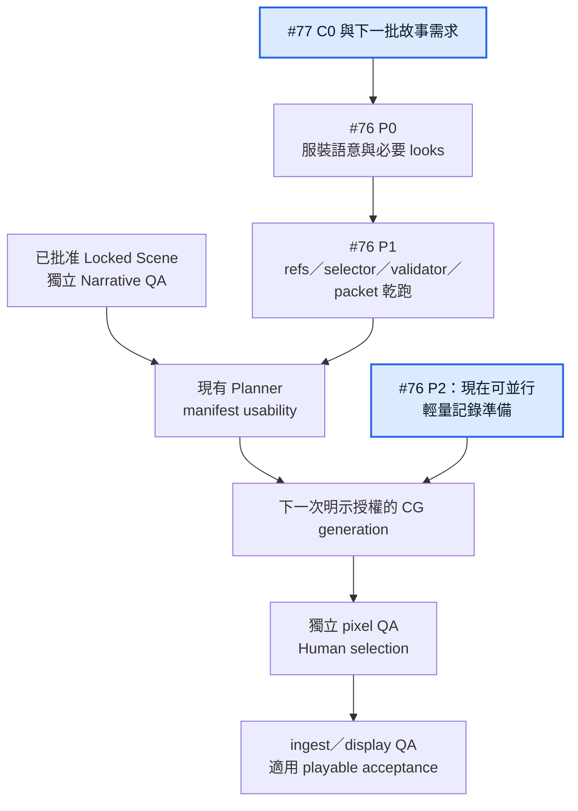

# Project Roadmap

> 本文件定義專案的產品與工程里程碑，以及目前應該優先完成的工作。
>
> 詳細技術工作見 `TODO.md`；內容生產進度見 `docs/narrative/CONTENT_PRODUCTION_TODO.md`；AI production 執行方式見 `.ai/WORKFLOW_MANIFEST.yaml`。
>
> 進度核對基線：2026-10-05 main `49e2ea37d588551d6c0dd78e8d4d579782b221f7`（PR #71、#69 已合併）。Opening／COMMON／OPEN-A 第一個 window 的入口，以及 Memories／累積解鎖與重玩已整合；完整 M1 slice 尚未完成；正式外部問卷／計時研究改為 M1 完成後按需安排。PR #69 exact head `e73d6ef…` 的 [Verify](https://github.com/TsungmingLiu/seventeen-floor-neighbor/actions/runs/37396221525) 記錄 315/315 tests、35/35 Chromium 與部署成功，不推定 post-merge main 或完整 M1 已驗收。
>
> M0 關閉證據仍見 [M0 acceptance](docs/migration/M0_FOUNDATION_ACCEPTANCE.md)。既有 title／provisional／accepted-as-is 與原 Visual QA 限制保持；本次路線圖更新不建立新的 scene、pixel QA 或 Human acceptance。
>
> Roadmap 不追蹤每一個 task。它只回答三個問題：
>
> 1. 我們現在在哪裡？
> 2. 下一個可驗證的產品成果是什麼？
> 3. 什麼條件達成後，才應該往下一階段走？

---

## 0. Single source of truth：先從這裡決定下一步

**`ROADMAP.md` 是 active milestone、工作優先順序、跨任務依賴、可並行範圍與 milestone exit gate 的唯一權威。** 想知道「現在先做哪件事」，先看本文件 §10；需要執行細節，再沿 issue 連結閱讀。

| 需要知道的事情 | 維護位置 |
| --- | --- |
| 現在的目標、先後順序、可並行工作、何時進入下一階段 | 本文件 |
| 任務 checklist、blocker、執行討論與結果連結 | GitHub issues；[#79](https://github.com/TsungmingLiu/seventeen-floor-neighbor/issues/79) 僅作路線圖入口與整併歷史索引 |
| 工程 backlog／內容製作進度 | `TODO.md`／`docs/narrative/CONTENT_PRODUCTION_TODO.md`；按本文件的 milestone 排期 |
| 場景事實、已鎖定內容、獨立 QA 與 Human 決定 | 各自 canonical artifact／receipt；本文件只連結與摘要，不取代它們 |

這是**排程與優先順序的單一權威**，不是把所有 source of truth 複製進一張文件。各 domain 的 authority 與衝突處理仍見 [.ai/policies/SOURCE_AUTHORITY.md](.ai/policies/SOURCE_AUTHORITY.md) 和 [source map](docs/CONTENT_PRODUCTION_SOURCE_MAP.md)。

維護規則：改變 milestone、依賴或 NOW／DEFERRED 排期時，先以同一輪變更更新本文件，再同步相關 issue。任務進度與證據更新留在 issue／receipt；不在 #79 維護另一套完整路線圖。關閉 issue 不自動代表 milestone exit gate 通過。

---

## 1. Product North Star

做出一款以都市成年人關係為核心的戀愛視覺小說：

- 玩家不是一開始就選定攻略角色；
- 前中期可以同時認識並接近不同角色；
- 玩家分配的是時間、注意力與誠實程度；
- choice 的重點是人物理解與 trade-off，而不是猜「標準答案」；
- 劇情、CG 與程式可以異步生產，但遊戲始終保持可玩；
- 最終內容規模建立在已被 playtest 驗證的玩法上。

---

# 2. Milestone Overview

| Milestone | 核心成果 | Exit Gate | 狀態 |
| --- | --- | --- | --- |
| **M0 — Foundation Stable** | 建立穩定、單一的 production / asset baseline | migration 完成，placeholder / stale dependency / build contract 穩定 | **DONE** |
| **M1 — Gameplay Validation** | 完成目標 30–60 分鐘的 core end-to-end playable slice | 內部路徑／state／save 驗證＋Owner 實際 end-to-end review | **NOW** |
| **M2 — Narrative Alpha** | 從遊戲開始到主要 endings 全部 playable | 主 narrative graph、state、save/replay 可 end-to-end 運作 | **LATER** |
| **M3 — Content Complete** | 劇情基本 freeze，正式視覺與內容覆蓋接近完整 | 無必要 placeholder，主要內容通過完整 playtest | **LATER** |
| **M4 — Release Candidate** | 得到可以公開發佈的候選版本 | release / device / performance / build QA 全部通過 | **LATER** |

### 里程碑順序

箭頭表示前一階段的 exit gate 通過後，才切換下一個 active milestone；不是五個 milestone 同時開工。

---

# 3. M0 — Foundation Stable

**狀態：DONE** — 2026-10-02，工程 gates、merged-main verification 與 final Human playable acceptance 見 [收尾證據](docs/migration/M0_FOUNDATION_ACCEPTANCE.md)。

## 已驗證的基線

- W1–W4 的 source/output、嚴格 asset check/build、Player UI、Memories、CG Gallery、journey v2 / v1 save migration 已實作；實際契約見 [`ARCHITECTURE.md`](ARCHITECTURE.md) 與 code/tests。現行試玩使用 Cloudflare PR 自動 build／部署，Codespaces 不再是必要驗收環境。
- PR #21 已將 active runtime 圖片遷至 repo，退役舊 `xu-tang` playable route；目前只有 `opening-demo` 註冊為 playable route。資產逐項 hash 與歷史對照見 `docs/migration/GATE2_REPO_RUNTIME_ASSETS.md`，現行檔案與使用範圍以 asset registry、route 與 build 為準。
- PR #33 已將 COM-02X 接入 Opening 可玩流程，使用已登記的 preview-only WebP；Memory 可重播，預覽圖不進 Gallery，既有敘事／POV／姓名輸入批准沿用。其餘 scene progress 由 `docs/narrative/CONTENT_PRODUCTION_TODO.md` 維護。
- PR #37 已接入批准的 COM-00 長段對白，修正江雨澄介紹前的姓名洩漏、統一旁白／自白正體，並以玩家設定姓名顯示男主 nametag。Human 已給敘事預覽品質 PASS；這不是正式美術接受。校準原始候選／重複快照已移至可追溯 Git 歷史，保留兩份限定用途的批准示例。
- main `f5e650b…` 的 [Node 22 Verify](https://github.com/TsungmingLiu/seventeen-floor-neighbor/actions/runs/36788149966)、Cloudflare 部署／部署後 smoke，以及 [遠端 Chromium acceptance](https://github.com/TsungmingLiu/seventeen-floor-neighbor/actions/runs/36788149811) 均成功；Browser Acceptance 已使用完整 checkout history。PR #37 公開試玩版本另有 83/83 unit、7/7 browser 與 built-file bytes 核對，見 ledger。舊索引中的 checkout failure／alias 403 不作當前 blocker。
- PR #39 已將 COM-02X 正式 BG／recognition／microwave／walk v3 接入便利店後半與回家流程；83 nodes、四 choices、文本／state、stable save IDs 與 Memory rank 160 保持。已記錄 Node 22 104/104、Chromium 11/11，以及固定 Cloudflare preview 的 bytes／forward flow／reload／Gallery PASS，見 [VERIFY-COM02X-VISUAL-BINDINGS-008](content/production/runs/com02x-visual-bindings-20261001/VERIFY-COM02X-VISUAL-BINDINGS-008.decision.json)。證據屬於 `ba5f832…` 的整合快照，不冒充本次新 main 的 CI；原 pixel QA FAIL／safe-zone NEEDS_REVIEW 與 Human accepted-as-is 範圍保持；該驗證快照當時尚未記錄 final Human playable acceptance，現已由後續 receipt 關閉。
- 2026-10-02 工程收尾已對目前 COM-02X 四張 runtime accepted-as-is 圖驗證受控 material-change／單張 visual-spec change 的失效範圍；新的定點 integration preflight 以非零 exit code 阻擋實際串接 build，來源失敗也移除舊 report。Node 22 focused 13/13；詳見 [當前 gate 證據](docs/migration/M0_CURRENT_SCENE_STALE_GATE.md)。PR #43 head `720843e…` 的 [Verify run 624](https://github.com/TsungmingLiu/seventeen-floor-neighbor/actions/runs/36966607788) 已通過 117/117 tests、build／validation 與 Cloudflare deployment／smoke；該 head 當時尚未合併，不當作新 main 驗收，不取代 QA／Human gates，也不包含 Issue #27 的 DAG 自動失效／恢復。preview → accepted-as-is CG 替換沿用 PR #39 證據；該受控驗證當時不代表所有 M0 Exit Gate 已完成。

- 2026-10-02 PR #43 已合併為 `c5251cd…`；main [Verify run 629](https://github.com/TsungmingLiu/seventeen-floor-neighbor/actions/runs/37008118459) 132/132、Cloudflare deployment／smoke PASS。Human final playable acceptance 已記錄於 [HUMAN-COM02X-PLAYABLE-009](content/production/runs/com02x-visual-bindings-20261001/HUMAN-COM02X-PLAYABLE-009.decision.json)，原 runtime／art bytes 與 QA 不改寫。M0 completed；該 PR #43 coverage 快照的七項 known constraints 不當作 release-ready。

- 2026-10-02 PR #45 已合併為 main `e28e45de188d1d788e63217d467a0a1448e4d24b`；已核對的 [Verify run 37034831902](https://github.com/TsungmingLiu/seventeen-floor-neighbor/actions/runs/37034831902) 綁定 exact PR head `43db3a2d186d71dcdc3db8dc4e6d74de90dc1127`，Verify job `110930333722` 與 deploy／smoke job `110933137975` success。title master／focus 的 Human 選擇不等於 title final playable acceptance；原 VQA `NEEDS_REVIEW` 與 checkpoint `READY_FOR_HUMAN_ACCEPTANCE` 保持。新 final derivative/display QA policy 為 prospective gate，不回寫既有 QA／Human records；此處未重新計算當前 strict release coverage。

## Outcome

建立一個可信任的 `main` baseline。

完成後：

- Narrative 可以先於 CG 開發；
- 缺 CG 不會阻塞 playable integration；
- 正式 CG 補上後不需要改寫 narrative/runtime 結構；
- visual asset 只有一套 active production/runtime paradigm；
- 上游內容修改時，指定 scene 的 visual artifact 會在整合前接受明確的 stale 影響檢查。

## Scope

M0 只處理目前已經開始的 production / asset architecture 收尾工作：

- 完成 repo-native visual asset migration；
- 建立 canonical placeholder asset contract；
- 區分 placeholder / provisional / accepted / release-ready；
- 以真實 scene 驗證 narrative → visual 的定點 stale detection 與整合前檢查；跨階段自動阻擋／恢復另由 [Issue #75](https://github.com/TsungmingLiu/seventeen-floor-neighbor/issues/75) 接續原 #27 追蹤；
- 清理 active source-of-truth 文件中的過期 asset/storage 描述；
- 保持 build、validate、tests、fresh playable acceptance 通過。

## Exit Criteria

M0 完成時必須滿足：

- 有 accepted CG 的 scene 正常使用正式 asset；
- 沒有 CG 的 Locked Scene 可以使用 canonical placeholder 並正常遊玩；
- placeholder 不可能被誤認為 release-complete asset；
- 對一個真實 scene 的受控修改，機器可讀報告能指出相關 visual artifact 是否 stale，並作為該輪整合前的檢查依據；
- active docs、source map、runtime 與 build 行為描述一致；
- 不再存在兩套互相競爭的 active asset/runtime production path；
- `main` 通過相關 build、validation、tests 與 fresh playable acceptance。

## Not Now

M0 不做：

- 大批 narrative scene；
- bulk final CG；
- 新 gameplay system；
- production orchestration engine；
- automatic image scoring / retry；
- speculative scale optimization；
- 與目前 migration 無直接關係的 release engineering。

**M0 通過後，停止繼續擴張 production framework。**

---

# 4. M1 — Gameplay Validation

**狀態：NOW**

## Outcome

完成一個約 **30–60 分鐘**的 Gameplay Validation Slice，第一次真正驗證：

**這款遊戲是否好玩，而不只是 production pipeline 是否能運作。**

## Slice 必須涵蓋

至少包含：

- 雙女主核心驗證路徑中，玩家與許棠、江雨澄都有實質互動；另保留可錯過江雨澄的較短合法走法，非每輪必見兩人；
- 一次 attention allocation / open dating 選擇；
- 每位女主至少一個 major interaction；
- 一次 crossover / shared-awareness scene；
- 一次 relationship friction；
- 一次具體 early friction repair（承認行為、詢問 cue、停止越界、女主接受／拒絕）；RE 只處理重新投入；
- 一次對關係或注意力具有實質影響的 decision。

Final CG 不是前置條件。

缺少美術的場景正常使用 M0 建立的 placeholder。

v0.6 macro／route-state 與部分 choice metadata 已存在；#71／#69 已交付本輪 discovery、COMMON/contact gating 與累積解鎖／重玩。COM-03J、COM-03M 與 OPEN-A 第一個 window 的入口已整合，不能再排成尚未開始。當前 pending 邀約仍停在未製作的 XT-04／JYC-05 前；solo/rest/wait 只完成第一個 window 的生活分支。

下一步是 [#77 C0](https://github.com/TsungmingLiu/seventeen-floor-neighbor/issues/77) 的 bounded consistency／gap review：對齊 [slice plan](docs/narrative/M1_GAMEPLAY_VALIDATION_SLICE.md)／blueprints 與 current accepted scene-local amendments，區分已交付入口和未製作的完整 slots／anchors／repair／SH-01／return。Owner 對已合併劇情／UI 的 review 範圍沿用 #71／#69；本文件不回填舊 ledger 或推定完整 slice 已獲 Human acceptance。

## 驗證重點

這個 milestone 要回答：

- 玩家是在做自己想做的決定，還是在猜正確答案？
- choice 是否有 trade-off？
- 許棠與江雨澄是否因具體人格而產生不同吸引力？
- 角色是否有超出核心心理主題之外的生活感？
- 男主是否具有自己的需求、缺點與人生方向？
- attention allocation 是否真的讓玩家感到自己的選擇改變了關係？
- crossover 是否產生自然 tension？
- conflict / repair 是否像真實人際互動？
- 玩家玩完之後是否想繼續？

## Engineering Scope

只增加支撐這個 playable slice 所必須的工程能力。

優先考慮最低限度的 graph/state validation：

- unreachable node；
- dangling target；
- impossible gate；
- dead / invalid state；
- knowledge contradiction；
- invalid transition。

不要提前做完整 model-checking framework。

## Exit Criteria

依 Owner 最新指示，M1 先做完完整 end-to-end 路線；問卷、招募、正式外部研究與計時 protocol 移到 **M1 完成後的 deferred／ad-hoc 工作**，不屬本 milestone，也不阻擋進入 M2。

M1 完成時：

- Selected core paths 可從唯一 entry 經實際 anchors／continuations／必要 repair、合法 shared／return 到明示 M1 endpoint；pending 邀約或未製作必要 successor 不冒充完整 core。
- [#78](https://github.com/TsungmingLiu/seventeen-floor-neighbor/issues/78) 的內部分支、knowledge、slot／closure／expiry、state、save／reload／Memory regression 與負向 cases 通過。
- Scene 的獨立 Narrative QA、runtime integration 與適用 Human review scope 有可追溯證據；Owner 實際走過 selected end-to-end 路線，已知阻斷性問題已處理。
- 30–60 分鐘是包含 Opening 的設計目標，正式外部量測 deferred。未量測不阻擋 M1 關閉，也不能宣稱外部品質／時長已實證。

有完整路線後，若要回答人物吸引力、consequence 可讀性、是否想繼續等問題，再由 #78 D1 按需啟動研究；不預先建立問卷／招募／計時工作包。

---

# 5. M2 — Narrative Alpha

**狀態：LATER**

## Outcome

把 M1 已驗證的設計擴張成完整可玩的主要 narrative。

玩家可以從 Start 一路走到主要 relationship-resolution endings。

Final CG 可以落後，但 playable integration 不應長期落後 Narrative 太遠。

## Content Scope

完成主要故事骨架：

- Common introduction；
- Open Dating / attention phases；
- Xu early / mid route；
- Jiang Yucheng early / mid route；
- braided / crossover scenes；
- heroine conflicts；
- repair；
- commitment / overlap；
- late route lock；
- Good / Friend / Distance；
- 必要 coda。

## Production Strategy

使用 bounded playable batches，而不是整條 route 寫完才 integration。

每個 batch 應完成：

1. Narrative；
2. Narrative QA；
3. Runtime integration；
4. Playable review；
5. Correction；
6. 視需要進入 visual production。

Narrative 可以領先 Final Art。

Narrative 不應長期大幅領先 Playable Build。

## Engineering Scope

只根據實際規模增加能力：

- state / graph traversal；
- knowledge consistency；
- batch integration validation；
- save / replay regression；
- stable persistent IDs；
- dependency invalidation。

不為假想的 3–4 女主規模提前重寫引擎。

## Exit Criteria

M2 完成時：

- Start →主要 endings 全部 playable；
- 主要 branch 可以正常抵達；
- conflict / repair / commitment logic 完整；
- state progression 基本穩定；
- save / replay semantics 可支撐主要流程；
- remaining placeholder 都是已知且刻意存在；
- major narrative structure 足夠穩定，可以進入 freeze。

此版本稱為：

**Narrative Alpha**

---

# 6. M3 — Content Complete

**狀態：LATER**

## Outcome

將 Narrative Alpha 轉成內容基本完整、主要結構 freeze 的版本。

從這個 milestone 開始，大量投資 final art 與 polish 才具有較低返工風險。

## Scope

主要包括：

- final CG coverage；
- 高價值 reaction / event CG；
- visual continuity repair；
- dialogue polish；
- pacing polish；
- Memories / Gallery polish；
- 必要 UI/UX polish；
- 如果確定納入 v1，再完成 audio / music；
- 完整 route playtest；
- 刪除、壓縮或重寫低價值 scene。

Final CG investment 依照：

- 情緒價值；
- 敘事價值；
- 收藏價值；
- replay value；

排序，而不是每個 scene 平均配置。

## Exit Criteria

M3 完成時：

- major narrative 基本 freeze；
- 沒有影響完整體驗的必要 placeholder；
- final visual coverage 達到產品要求；
- route pacing 經過完整 playtest；
- 主要 UI / Memories / Gallery 體驗穩定；
- 不再預期大幅修改核心玩法或 narrative architecture。

此版本可以視為：

**Content Complete Beta**

---

# 7. M4 — Release Candidate

**狀態：LATER**

## Outcome

將 Content Complete Beta 轉成可公開發佈的 Release Candidate。

這個 milestone 只處理產品化、可靠性與 release readiness。

## Scope

視最終 release 需求完成：

- mobile / browser performance；
- asset loading / preload / caching；
- final save migration；
- clean/reproducible build；
- review / release workflow；
- hosting / CDN；
- device/browser regression；
- release smoke tests；
- 如果產品確實需要，再完成 SFW / Full profiles；
- 最終 external playtest。

W5 / W6 / W7 等既有 technical proposal 必須以 M4 開始時真正存在的 architecture 重新評估，不因舊 TODO 已存在就自動執行。

## Exit Criteria

Release Candidate 必須：

- 沒有非預期 placeholder；
- 沒有 stale production artifact；
- 主要 narrative paths 完整；
- final asset coverage 完整；
- technical/content validation 通過；
- target device performance 可接受；
- external playtest 完成；
- 可以從明確 source revision reproducibly build；
- 可以穩定 deploy。

---

# 8. Backlog Horizons

Roadmap 只維護工作所在的 horizon，不維護完整 task list。

## NOW

只包含直接幫助 **M1 Gameplay Validation** 的工作；完整依賴與並行邊界見 §10。

- [#77](https://github.com/TsungmingLiu/seventeen-floor-neighbor/issues/77)：先完成 C0 current-main 一致性／缺口核對，再按各自前事製作 XT-04／JYC-05、continuations／真 early repair、SH-01，以及有限 slots／bounded return。
- [#78](https://github.com/TsungmingLiu/seventeen-floor-neighbor/issues/78)：現在只準備 internal coverage matrix；契約固定後補 slice 必需的 graph/state/save 檢查，逐批確認完整 end-to-end core。問卷、招募與正式外部計時不排入 NOW。
- 使用已登記的 preview placeholder 支援缺 CG 的場景；保持 narrative integration 與 final art 解耦，不無故重寫已接受 Opening。
- [#76 P0–P3](https://github.com/TsungmingLiu/seventeen-floor-neighbor/issues/76)：M1 期間並行準備下一批 CG 的服裝語意、必要單套 refs／routing、輕量 telemetry；只提升直接妨礙 playtest 的顯示缺陷。全 34 looks、全面修圖與 rollout 仍 deferred。
- 已交付的 discovery／Memories 整合與 M0 foundation 不重開成新的 blocker；deferred 殘項見 §10。

## NEXT

完成 M1 core end-to-end 路線、內部驗證與 Owner review，再決定進入 M2 Narrative Alpha。Formal questionnaire／外部計時研究在 M1 完成後按需安排，不是 M2 的前置。

## LATER

M2–M4 已知但目前不應執行的工作。

例如：

- full narrative production；
- bulk CG production；
- final UI polish；
- performance optimization；
- release engineering。

## ICEBOX

目前沒有足夠實際需求支持的項目。

例如：

- 更多 heroine；
- achievements；
- 通用 Content Factory；
- 全自動 orchestration；
- 複雜 scoring / retry system；
- 其他建立在未來假設規模上的 framework。

---

# 9. Roadmap Rules

1. 同一時間只有一個 Active Milestone。
2. 新發現的問題不會自動進入 `NOW`。
3. 只有直接影響目前 Exit Gate 的工作才能插入 current scope。
4. 下一 Milestone 的工作可以準備，但不能搶占 current critical path。
5. Roadmap 追蹤 outcome，不追蹤每個 implementation task。
6. GitHub Issues、`TODO.md`、Content TODO 負責具體執行項目。
7. Milestone Exit Gate 通過後，才正式切換下一 Milestone。
8. 不因為某個 future feature 已經寫進 spec，就代表現在必須實作。

---

# 10. Current Position：M1 執行路線圖

**Active milestone：M1 Gameplay Validation。** 目標是包含 Opening、約 30–60 分鐘的 end-to-end core；時長是設計目標，正式外部量測 deferred。從未解鎖江雨澄的較短生活／許棠走法仍合法。

## 下一件事與 M1 active task issues

| 工作 | 現在可以開始什麼 | 完成後接什麼 |
| --- | --- | --- |
| [#77 — 內容與整合](https://github.com/TsungmingLiu/seventeen-floor-neighbor/issues/77) | **C0：核對 current main、已批准入口／累積解鎖與舊 plan 的差異** | 契約明確後製作 XT-04／JYC-05，再依前事接 continuation、repair、SH-01 與有限 return |
| [#78 — 內部 end-to-end 驗證](https://github.com/TsungmingLiu/seventeen-floor-neighbor/issues/78) | internal coverage matrix 與回歸案例 | 契約固定後補 machine checks；完整路線與負向案例通過，再做 Owner review |
| [#76 P0–P3 — CG 前置改善](https://github.com/TsungmingLiu/seventeen-floor-neighbor/issues/76) | P2 輕量記錄準備、P0 下一批服裝需求核對、P3 內部試玩 blocker triage | P0 範圍固定後完成本批 P1 exact-look routing；下一批正式生圖前就緒 |

C0 也核對尚未記錄的 gate 與其他進度文件，不把舊 checklist 未勾選解讀為已合併功能尚未交付。保留 #71 的 earned-discovery 決策：書店初遇真正解鎖才走咖啡重逢；只咖啡初遇仍走初遇；任一真正初遇的累積資格不因後來街景／重玩撤銷，但不補造 local contact、購書、knowledge 或 consent。

## M1 先後順序與可並行工作

這是**製作／驗收的依賴圖**，不是玩家必走的故事順序。核心 coverage 需要驗證兩條女主線；每次遊玩仍只走實際合法分支。藍色是現在可開始的工作；虛線表示條件性前事或非必經的 ad-hoc 研究；不要求兩位女主都符合 RE 條件，研究也不擋 M2。

**可並行的範圍：**

- C0 核對時，#78 可以準備內部路徑與回歸案例；#76 P2 可準備輕量 telemetry，P0 可核對下一批 CG 的服裝語意／可見人物需求。
- C0 與各 scene prerequisite 固定後，XT-04／JYC-05 分別製作；各自前幕完成後，許棠 continuation 與江雨澄 co-op／家訪可繼續並行。
- 已批准契約的 machine-check cases 可與該 scene 的對白工作並行；checks 跟隨每個整合批次。
- 共用 chapter／registry 的 wiring 依批次順序整合；兩個 worker 不同時改同一份共用檔。

**不能跳過的前置條件：**

- SH-01 等實際 JYC-06 與 `contact_xu`；未介紹前不能讓角色知道彼此關係。
- 每位女主只有真正 prior investment／已接受未成行 plan 等條件成立時，才有 RE；contact 或 recentFocus 單獨不足。普通首邀不生成假 missed-history。
- unresolved harm 先處理具體 repair；RE 不等於 repair。有限 slot／唯一相鄰 reopening window／拒絕與 expiry 的 boundary 保持。
- M1 exit 等核心路徑、內部負向案例與 Owner 實際 end-to-end review；CI／merge 不代替 semantic／Human acceptance。問卷與正式外部研究等 M1 完成後再決定。

## 每個 scene 內部仍按順序製作

「兩條女主線可並行」不表示同一 scene 的 writer、QA、integrator 同時開工。各 pass 用 fresh bounded worker；語意與 Human gates 不能由 machine PASS 取代。

本輪沿用現有 orchestration／Task Packet／preflight／handoff；不新增 production engine。Final CG 不在 M1 上述依賴鏈內；正式美術另走 manifest／render／獨立 pixel QA／Human selection／ingest／display QA gates。

## M1 並行的 CG 前置改善：#76 P0–P3

這批工作提升輸入的可控性與收益可量測性；**純文字 M1 不等待 refs crop 或正式 CG**。下一批正式生圖前，先完成該批必要 exact-look refs、selector／validator／deterministic packets 與記錄能力，不要求做滿 34 looks／68 assets。這裡列的是實作任務，不宣稱已交付或已證明品質提升。

- P0：與 #77 C0 對齊下一批 visible characters／wardrobe keys／continuity，提供 bounded writer-safe 語意選項。若同批準備正式 CG，先鎖故事服裝；不回寫 accepted／legacy history。
- P1：只做本批實需 looks 的 upper／full、provenance 與 routing；缺 ref／wrong key／cross-character／hash mismatch fail closed。先乾跑，不為準備工作自動生成圖片。
- P2：現在準備最小記錄格式；下一次明示授權的生成從首次 attempt 記 actual elapsed、可得 tokens、Human 操作／修正與 QA 結果。未提供的值標 not exposed／not measured，不拿 bytes 推定 ROI。
- P3：觀察到遮擋對白／關鍵 crop／劇情誤讀等 內部試玩 blocker 才提升修正；其他 historical art debt 延後。

Writer 在本批適用契約下選 wardrobe，Planner carry/validate；新 ownership／refs path 依最小相容擴充導入，不把圖片或 renderer context 給 writer。各 scene 的敘事審查順序仍見上圖。
P1 可與服裝語意固定後的 dialogue／NQA 並行；共用 registry／selector 按批次整合。**這張 CG 圖不接到 M1 文字 end-to-end 驗證 的必經路徑**；P3 若發現直接 blocker，才成為對應內部試玩的前置修正。M1 exit 不等待 #76 全部 deferred 工作。

## Deferred 工作何時重啟

以下 tracker 保存剩餘需求與原 issue 追溯，不是 M1 blocker，也不因 M1 通過就全部自動開工。

| Tracker | 重啟條件／horizon | 與 M1 的關係 |
| --- | --- | --- |
| [#73 — 完整 narrative](https://github.com/TsungmingLiu/seventeen-floor-neighbor/issues/73) | M1 exit 後，M2 的完整 lifecycle／choice governance／clarity／endings／After Story | M1 只實作 core slice 所需的 bounded subset |
| [#74 — 地圖與架構 scaling](https://github.com/TsungmingLiu/seventeen-floor-neighbor/issues/74) | M2 有真實 graph 規模需求；M3 polish／M4 device 與效能驗收 | 現有兩女主 correctness 留在 #78；不為假想 5／8 人重寫引擎 |
| [#75 — production efficiency](https://github.com/TsungmingLiu/seventeen-floor-neighbor/issues/75) | 實際 production friction／新 scene ROI 或 multi-task stale recovery 的測量需求成立 | 不以新 framework／Story IR 阻塞 M1 |
| [#76 D1–D3 — 美術與研究殘項](https://github.com/TsungmingLiu/seventeen-floor-neighbor/issues/76) | 穩定 scene／M3 按價值投資；rollout 等實際 evidence 與 Human 決定 | 全 looks／全面修圖／完整 rollout 延後；M1 P0–P3 見上節 |

#72 的 bounded A/B 結論是 manifest 小幅改善、pixels 無穩定總勝者、實際 token/time ROI 未量測；保留 lightweight testing guidance、加 telemetry、暫不 rollout。#76 的 evidence 與 Human gate 仍必要，不能從本表取得 rollout approval。

## Deferred／ad-hoc：M1 完成後才安排問卷

[#78 D1](https://github.com/TsungmingLiu/seventeen-floor-neighbor/issues/78) 保存可能的問卷／外部計時研究方向。**現在不做問卷設計、招募、正式研究 protocol 或計時表**；M1 完成、有完整 end-to-end 路線後，再看具體產品問題決定是否啟動，可持續 deferred。未安排研究或未取得外部數據，不阻擋 M1 關閉／M2 開始。

CG production 的 #76 P2 elapsed／tokens／修正次數記錄仍屬 M1 並行的工程 telemetry，不是玩家問卷或研究 protocol，範圍不變。Long-term M3／M4 的完整體驗與 release 驗證由各 milestone 當時的需求決定。

## M1 exit 與下一階段

完整 selected core 從 entry 到明示 endpoint 可玩，內部分支／state／save／Memory 與負向 cases 有 exact build evidence，scene NQA／integration／適用 Human review scope 已記錄。Owner 實際走完 end-to-end 路線、已知阻斷性問題處理後，review M1 結論並進 M2。Formal questionnaire、招募與外部計時不屬 exit gate；正式品質／時長仍未外部實證，待有需要時另驗。

本輪不納 BRAID-C、late clarity／COMMIT／endings、bulk final CG、更多 heroine 或新的 production framework。各任務詳細 checklist 見 #77／#78／#76 P0–P3；整併前的完整描述、關閉理由與追溯表保留於 [#79](https://github.com/TsungmingLiu/seventeen-floor-neighbor/issues/79)。

